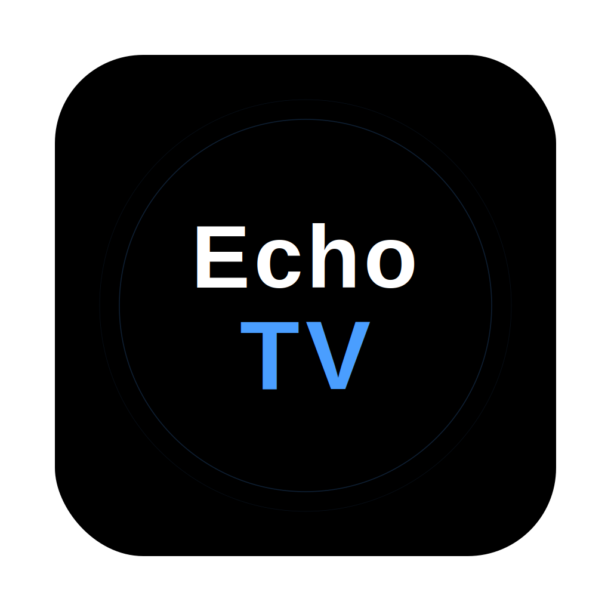

# 📺 EchoTV

<p align="center">
  
  <br>
  <b>极致纯净的 Zen-iOS 风格全平台影视聚合客户端</b>
  <br>
  <i>「 视界随心，静谧无界 」</i>
</p>

---

## 🎐 设计理念

EchoTV 采用 **Zen-iOS Hybrid** 设计语言，追求物理触感、光学模糊与工业美学的平衡。我们致力于在不同平台提供一致、极简且无干扰的视听交互体验。

- **视觉灵感**：本项目在交互与视觉风格上深受 [LunaTV](https://github.com/MoonTechLab/LunaTV.git) 的启发，并基于 Flutter 全平台特性进行了深度的架构重构与性能优化。

---

## 🌟 核心特性

- 📽️ **影视发现**：深度整合豆瓣数据流，实现个人资源站与精选榜单的智能匹配与聚合展示。
- 🛡️ **HLS 广告拦截**：独创本地代理重写技术，精准剔除 M3U8 索引中的插播广告分片，还原纯净片源。
- 📺 **订阅式直播**：支持标准 M3U 格式，用户可通过远程 URL 或本地文件自定义订阅个性化频道。
- 🔗 **多源智能聚合**：兼容 AppleCMS (JSON) 标准接口，通过多线程测速与权重算法自动优选最佳线路。
- 🔄 **配置云同步**：支持一键导出完整 JSON 配置或通过远程订阅实现多端同步。
- 👶 **青少年模式**：内置内容过滤引擎，支持自定义关键字拦截，营造绿色观看环境。

> ⚠️ **重要声明**：EchoTV 是一个纯粹的本地/远程资源管理工具。**本项目不内置、不提供、不分发任何影视资源或直播源。** 所有内容均需由用户自行配置合法来源。

---

## 📱 平台支持

基于 Flutter 构建，实现了真正的全平台一致性视觉与功能体验：

| 平台 | 状态 | 产物格式 | 说明 |
| :--- | :--- | :--- | :--- |
| **macOS** | ✅ 完美支持 | `.dmg` / `.app` | 深度适配 Apple Silicon 与 Intel，支持全屏沉浸模式 |
| **iOS** | ✅ 完美支持 | `.ipa` | 支持 AltStore/Sideloadly 手动签名，适配动态岛 |
| **Android** | ✅ 完美支持 | `.apk` | 适配各架构安装包，支持 Android TV 基础交互 |
| **Windows** | ✅ 完美支持 | `.zip` | 绿色免安装运行，完美窗口化与快捷键支持 |
| **Linux** | ✅ 完美支持 | `.tar.gz` | 基于 GTK+ 构建，适配主流桌面环境 |
| **Web** | ✅ 预览支持 | `HTML/JS` | 基础功能预览，受限于浏览器跨域策略 |

---

## 🛠️ 技术选型

- **核心框架**: [Flutter 3.x](https://flutter.dev/)
- **状态管理**: [Riverpod 3](https://riverpod.dev/) (响应式、类型安全、全局一致性)
- **网络层**: [Dio](https://pub.dev/packages/dio) + 自研本地 HTTP 代理拦截引擎
- **播放引擎**: [Video Player](https://pub.dev/packages/video_player) + [Chewie](https://pub.dev/packages/chewie) (深度定制)
- **路由系统**: [GoRouter](https://pub.dev/packages/go_router) (声明式路由)
- **UI 组件**: 自研 [Zen UI Library](lib/widgets/zen_ui.dart) (支持毛玻璃、物理缩放特效)
- **图标系统**: [Lucide Icons](https://lucide.dev/) (极致线条精简)

---

## 🚀 快速开始

### 开发者准备
- 安装最新稳定版 Flutter SDK。
- 配置对应平台的编译环境（Xcode, Android Studio, Visual Studio 等）。

### 编译运行
```bash
# 1. 克隆仓库
git clone https://github.com/hoowhoami/EchoTV.git

# 2. 安装依赖
flutter pub get

# 3. 启动应用
flutter run
```

---

## 📜 开源协议

本项目遵循 [MIT License](LICENSE) 协议。